# HackOS

> **Open-source, ESP32-based hardware hacking companion** – a portable multi-tool for Wi-Fi, NFC, IR, RF signal research and SD-card capture management, running a lightweight cooperative OS on FreeRTOS/Arduino.

---

## Table of Contents

1. [Introduction](#introduction)
2. [Architecture Diagram](#architecture-diagram)
3. [Hardware Requirements](#hardware-requirements)
4. [Installation Guide (PlatformIO)](#installation-guide-platformio)
5. [App Lifecycle](#app-lifecycle)
6. [Adding Your Own App](#adding-your-own-app)
7. [Built-in Apps](#built-in-apps)
8. [Project Structure](#project-structure)
9. [License](#license)

---

## Introduction

HackOS is a firmware project for the **ESP32 DevKit v1** that turns the microcontroller into an interactive RF/NFC/IR/Wi-Fi research platform with a tiny OLED display and a joystick for navigation.

Key design principles:

| Principle | Description |
|---|---|
| **Singleton HAL** | Every hardware driver exposes a single `instance()` accessor – no global variables, no re-initialisation races. |
| **Event-Driven Core** | UI inputs, Wi-Fi scan completions, system transitions, and app launches all travel through `EventSystem` as typed `Event` structs. |
| **App Abstraction** | All user-facing features inherit from `AppBase`. The `AppManager` owns the active app and drives its lifecycle (`onSetup → onLoop → onDraw → onDestroy`). |
| **30 FPS cooperative scheduler** | `AppManager::loop()` runs at most one `onDraw()` every 33 ms; `vTaskDelay` yields to FreeRTOS between ticks. |

---

## Architecture Diagram

```mermaid
graph TD
    subgraph main["main.cpp  (Arduino setup/loop)"]
        SETUP["setup()  –  HAL init, app registration"]
        LOOP["loop()  –  dispatch events, AppManager::loop()"]
    end

    subgraph core["Core Layer"]
        ES["EventSystem\n(queue + observer list)"]
        AM["AppManager\n(active app owner)"]
        SM["StateMachine\n(BOOT → SPLASH → LAUNCHER → APP_RUNNING)"]
    end

    subgraph apps["Apps Layer"]
        LA["LauncherApp"]
        WA["WiFiToolsApp"]
        NA["NFCToolsApp"]
        IA["IRToolsApp"]
        RA["RFToolsApp"]
        FA["FileManagerApp"]
        AA["AmiiboApp"]
    end

    subgraph hal["Hardware Abstraction Layer"]
        DM["DisplayManager\n(SSD1306 OLED)"]
        IM["InputManager\n(Joystick ADC + button)"]
        WL["Wireless\n(ESP-IDF WiFi)"]
        NR["NFCReader\n(PN532 SPI)"]
        IR["IRTransceiver\n(IRremoteESP8266)"]
        RF["RFTransceiver\n(rc-switch 433 MHz)"]
        ST["StorageManager\n(SD SPI)"]
    end

    SETUP --> AM
    SETUP --> ES
    SETUP --> SM
    LOOP --> ES
    LOOP --> AM

    AM -->|"onSetup/onLoop/onDraw/onDestroy"| LA
    AM -->|"onSetup/onLoop/onDraw/onDestroy"| WA
    AM -->|"onSetup/onLoop/onDraw/onDestroy"| NA
    AM -->|"onSetup/onLoop/onDraw/onDestroy"| IA
    AM -->|"onSetup/onLoop/onDraw/onDestroy"| RA
    AM -->|"onSetup/onLoop/onDraw/onDestroy"| FA
    AM -->|"onSetup/onLoop/onDraw/onDestroy"| AA

    ES -->|"EVT_INPUT"| AM
    ES -->|"EVT_SYSTEM / EVT_APP"| AM

    LA -->|"EVT_APP APP_EVENT_LAUNCH"| ES
    WA -->|"EVT_SYSTEM BACK"| ES
    WA --> WL
    WA --> ST
    NA --> NR
    NA --> ST
    IA --> IR
    IA --> ST
    RA --> RF
    FA --> ST
    AA --> NR
    AA --> ST

    AM --> DM
    AM --> IM
```



---

## Hardware Requirements

| Component | Part | Interface | Pin(s) |
|---|---|---|---|
| MCU | ESP32 DevKit v1 (240 MHz, 4 MB Flash) | — | — |
| Display | SSD1306 OLED 128×64 | I²C | SDA=21, SCL=22 |
| Input | KY-023 joystick | ADC + GPIO | X=34, Y=35, SW=32 |
| SD card | MicroSD SPI adapter | SPI (VSPI) | CS=5, SCK=18, MISO=19, MOSI=23 |
| NFC | PN532 module | SPI (VSPI) | CS=17 |
| IR | TSOP/KY-005 | GPIO | RX=15, TX=4 |
| RF | 433 MHz OOK module | GPIO | RX=16, TX=25 |

---

## Installation Guide (PlatformIO)

### Prerequisites

* [PlatformIO Core](https://docs.platformio.org/en/latest/core/installation/index.html) ≥ 6.x  
  ```bash
  pip install platformio
  ```
* Python ≥ 3.8
* USB driver for CP2102 / CH340 (depends on your DevKit variant)

### Clone and build

```bash
git clone https://github.com/El-EnderJ/HackOS.git
cd HackOS
pio run                         # compile for esp32dev
pio run --target upload         # flash (ensure correct serial port)
pio device monitor              # open serial monitor at 115200 baud
```

PlatformIO will automatically fetch all library dependencies declared in `platformio.ini`:

```
adafruit/Adafruit SSD1306       ^2.5.7
adafruit/Adafruit GFX Library   ^1.11.9
adafruit/Adafruit PN532         ^1.2.2
arduino-libraries/SD            ^1.2.4
crankyoldgit/IRremoteESP8266    ^2.8.6
sui77/rc-switch                 ^2.6.4
```

### Custom partition table

HackOS uses the custom `partitions.csv` to reserve adequate flash for the firmware and OTA slots.  
Do **not** change `board_build.partitions` unless you know what you are doing.

### SD card preparation

1. Format a microSD card as **FAT32**.
2. Create the directory `/captures/` on the card.
3. Optionally create `/nfc/amiibo/` and populate it with `.bin` dumps of NTAG215 Amiibos (540 bytes each), organised in sub-folders (e.g. `Zelda/`, `Mario/`).
4. Insert before powering on – the StorageManager attempts `SD.begin()` during `setup()` and logs the result.

---

## App Lifecycle

Every application inherits from `AppBase` and implements five virtual methods:

```
      ┌─────────────────────────────────────────────────────┐
      │                  AppManager::launchApp()            │
      │                         │                           │
      │                    ┌────▼────┐                      │
      │                    │onSetup()│ ◄── one-time init    │
      │                    └────┬────┘                      │
      │                         │                           │
      │             ┌───────────▼──────────┐               │
      │             │  cooperative loop     │               │
      │             │  ┌──────────────┐    │               │
      │             │  │  onLoop()    │    │  every tick   │
      │             │  └──────┬───────┘    │               │
      │             │         │            │               │
      │             │  ┌──────▼───────┐    │               │
      │             │  │  onDraw()    │    │  ≤ 30 FPS     │
      │             │  └──────┬───────┘    │               │
      │             │         │            │               │
      │             │  ┌──────▼───────┐    │               │
      │             │  │  onEvent()   │    │  async events │
      │             │  └──────────────┘    │               │
      │             └───────────────────────┘               │
      │                         │                           │
      │              SYSTEM_EVENT_BACK fired                │
      │                         │                           │
      │                  ┌──────▼──────┐                   │
      │                  │onDestroy()  │ ◄── cleanup       │
      │                  └─────────────┘                   │
      └─────────────────────────────────────────────────────┘
```

### Event routing rules

* `EVT_INPUT` events are **not** forwarded by AppManager; apps subscribe to `EventSystem` directly in `onSetup()`.
* All other event types (`EVT_SYSTEM`, `EVT_APP`, `EVT_WIFI_SCAN_DONE`) are forwarded by AppManager to the active app's `onEvent()`.
* Apps post `EVT_SYSTEM / SYSTEM_EVENT_BACK` to navigate back to the Launcher.
* The Launcher posts `EVT_APP / APP_EVENT_LAUNCH(index)` to launch sub-apps.

---

## Adding Your Own App

### Step 1 – Create the factory header

```cpp
// include/apps/my_app.h
#pragma once
#include "apps/app_base.h"

AppBase *createMyApp();
```

### Step 2 – Implement the app

```cpp
// src/apps/my_app.cpp
#include "apps/my_app.h"
#include <new>
#include "core/event.h"
#include "core/event_system.h"
#include "hardware/display.h"
#include "hardware/input.h"
#include "ui/widgets.h"

static constexpr const char *TAG_MY = "MyApp";

namespace {

class MyApp final : public AppBase, public IEventObserver
{
public:
    MyApp() : statusBar_(0, 0, 128, 8), menu_(0, 20, 128, 36, 3),
               needsRedraw_(true) {}

    void onSetup() override
    {
        (void)EventSystem::instance().subscribe(this);
        static const char *const items[] = { "Option A", "Option B", "Back" };
        menu_.setItems(items, 3U);
        statusBar_.setBatteryLevel(100U);
        needsRedraw_ = true;
    }

    void onLoop() override {}   // polling logic here

    void onDraw() override
    {
        if (!needsRedraw_ && !statusBar_.isDirty() && !menu_.isDirty()) return;
        DisplayManager::instance().clear();
        statusBar_.draw();
        DisplayManager::instance().drawText(2, 10, "My App");
        DisplayManager::instance().drawLine(0, 18, 127, 18);
        menu_.draw();
        DisplayManager::instance().present();
        statusBar_.clearDirty(); menu_.clearDirty();
        needsRedraw_ = false;
    }

    void onEvent(Event *event) override
    {
        if (event == nullptr || event->type != EventType::EVT_INPUT) return;
        const auto input = static_cast<InputManager::InputEvent>(event->arg0);
        if (input == InputManager::InputEvent::UP)        menu_.moveSelection(-1);
        else if (input == InputManager::InputEvent::DOWN) menu_.moveSelection(1);
        else if (input == InputManager::InputEvent::BUTTON_PRESS)
        {
            if (menu_.selectedIndex() == 2U) // Back
            {
                const Event evt{EventType::EVT_SYSTEM, SYSTEM_EVENT_BACK, 0, nullptr};
                EventSystem::instance().postEvent(evt);
            }
        }
    }

    void onDestroy() override { EventSystem::instance().unsubscribe(this); }

private:
    StatusBar   statusBar_;
    MenuListView menu_;
    bool         needsRedraw_;
};

} // namespace

AppBase *createMyApp() { return new (std::nothrow) MyApp(); }
```

### Step 3 – Register in `main.cpp`

```cpp
#include "apps/my_app.h"
// …inside setup():
(void)AppManager::instance().registerApp("my_app", createMyApp);
```

That's it – the Launcher will automatically display `"my_app"` in its menu.

### Naming conventions (enforced by CI)

| Item | Rule | Example |
|---|---|---|
| App factory header | `include/apps/<name>_app.h` | `file_manager_app.h` |
| App factory source | `src/apps/<name>_app.cpp` | `file_manager_app.cpp` |
| Factory function | `create<PascalCase>App()` | `createFileManagerApp()` |
| App class | `<PascalCase>App` (inside anonymous namespace) | `FileManagerApp` |
| HAL singleton | `<PascalCase>::instance()` | `StorageManager::instance()` |
| Log tag | `"<PascalCase>App"` or `"<ModuleName>"` | `"FileManagerApp"` |

---

## Built-in Apps

| App | Key `name` | Description |
|---|---|---|
| **Launcher** | `launcher` | Home screen; lists and launches all registered apps |
| **WiFi Tools** | `wifi_tools` | Scan APs, deauth, show AP info, save scan to SD |
| **NFC Tools** | `nfc_tools` | Read UID, dump Mifare 1K sectors, save UID to SD |
| **IR Tools** | `ir_tools` | Sniff/clone IR codes, save captured code to SD |
| **RF Tools** | `rf_tools` | Receive/transmit 433 MHz OOK codes |
| **File Manager** | `file_manager` | Browse SD card directories; shows name, size |
| **Amiibo Master** | `amiibo` | Browse SD for NTAG215 .bin dumps, emulate Amiibos, write to blank tags |

### Capture file paths on SD

| App | Output file |
|---|---|
| WiFi Tools → Save AP | `/captures/wifi_scan.txt` |
| NFC Tools → Save UID | `/captures/nfc_uid.txt` |
| IR Tools → Save Code | `/captures/ir_codes.txt` |

---

## Project Structure

```
HackOS/
├── include/
│   ├── config.h                  ← GPIO pin constants
│   ├── apps/
│   │   ├── app_base.h            ← AppBase pure interface
│   │   ├── launcher_app.h
│   │   ├── wifi_tools_app.h
│   │   ├── nfc_tools_app.h
│   │   ├── amiibo_app.h
│   │   ├── ir_tools_app.h
│   │   ├── rf_tools_app.h
│   │   └── file_manager_app.h
│   ├── core/
│   │   ├── event.h               ← Event struct + EventType enum
│   │   ├── event_system.h        ← EventSystem singleton + IEventObserver
│   │   ├── app_manager.h         ← AppManager singleton
│   │   └── state_machine.h       ← GlobalState machine
│   ├── hardware/
│   │   ├── display.h             ← DisplayManager (SSD1306)
│   │   ├── input.h               ← InputManager (joystick)
│   │   ├── wireless.h            ← Wireless (WiFi scan/deauth)
│   │   ├── nfc_reader.h          ← NFCReader (PN532)
│   │   ├── ir_transceiver.h      ← IRTransceiver
│   │   ├── rf_transceiver.h      ← RFTransceiver (433 MHz)
│   │   └── storage.h             ← StorageManager (SD card)
│   └── ui/
│       ├── widget.h              ← Widget base class
│       └── widgets.h             ← MenuListView, StatusBar, ProgressBar, DialogBox
├── src/
│   ├── main.cpp
│   ├── apps/   (mirrors include/apps/)
│   ├── core/   (mirrors include/core/)
│   ├── hardware/
│   └── ui/
├── partitions.csv
└── platformio.ini
```

---

## License

HackOS is released under the **MIT License**.  
See `LICENSE` for the full text.

> **Legal notice**: The deauthentication and RF replay features are provided for **authorised penetration testing and educational research only**. Transmitting deauth frames or replaying RF signals against systems you do not own or have explicit written permission to test is illegal in most jurisdictions. The authors assume no liability for misuse.